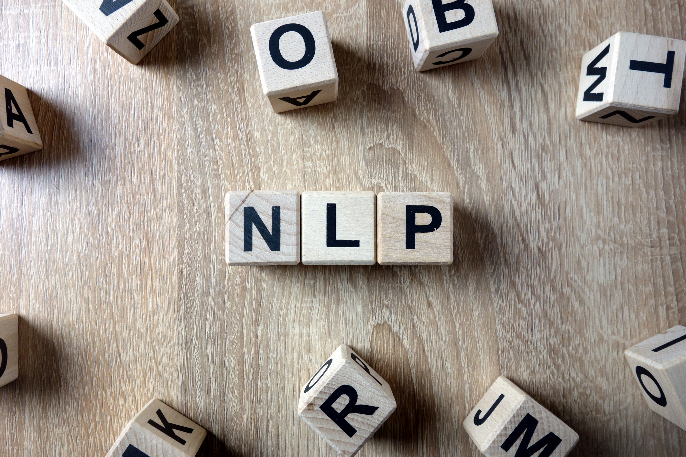

# NLP-experiments
A few notebooks with various text mining and natural language processing experiments

## Mail order

https://github.com/protzetter/NLP-experiments/blob/main/ordermail.ipynb

Using spacy we can detect the intent of a customer using the entity ruler and the syntactic parser. The example reads the file ordermail.txt abd tries to detect the intent of the customer and the object he is trying to order
A more complete description can be found under https://chatbotslife.com/natural-language-processing-smarter-conversations-using-spacy-c725e810695?sk=9e569dc89a80ed381601c241e815a190

## Document mining Part 1
Document mining with spacy is fun, in this notebook we look at various mining techniques to go through a few documents about innovation in Insurance

## Document mining Part 2
In this notebook we look at tfidf representation and also potential clustering of documents using PCA to reduce the tfidf matrix dimension. There ate not enough documents to identify clear clusters, but same can be used for more documents.

## Document mining Part 3
In this notebook we will use document similarities to compare documents to each others

## Document mining Part 4
This notebook will check elasticsearch capabilities for our given use case. The notebook is largely inspired by the book http://www.practicalnlp.ai/ This notebook is only going to work if an instance of elasticsearch is reachable at localhost:9200 ( or you can change the parameters in cell 2 below) 

## Document mining Part 5
This notebook will check the usage of the Azure analytics API and see how this can accelerate the overall process

## Document mining Part 6
We will be using the brand new spacy version 3.0 for tokenization, parsing and named entity recognition. We will then look at some simple statistics based on spacy results.

## Document mining Part 7
Let us try T5 summarization capabilities ( example for summarization function from denis Rothman book Transformers for Natural Language Processing

## Document mining Part 8
Topic modeling is a very interesting aspect of document classification and search. In this notebook we are explorin topic modeling using AWS Comprehend topic modeling feature.

## Document mining Part 9
Topic modeling is a very interesting aspect of document classification and search. In this notebook we are explorin topic modeling using the built-in LDA topic modeling algorithm from SageMaker

## Document mining Part 10
Topic modeling is a very interesting aspect of document classification and search. In this notebook we are explorin topic modeling using the built-in NTM topic modeling algorithm from SageMaker
